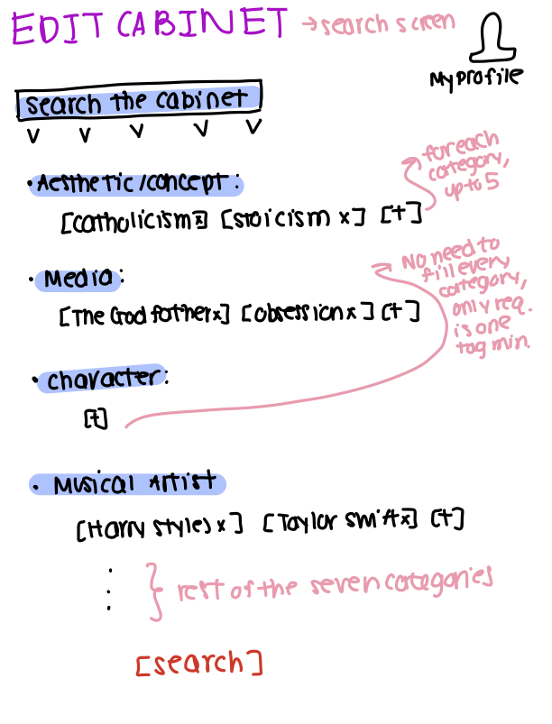

# Problem Statement

## Domain

The domain in which the problem lies is fan-editing/video-editing/editing culture. A fan-edit/video-edit/edit is a collection of videos or photographs synced to some form of musical audio and made for a variety of purposes, most commonly to express appreciation for a certain piece of cinematic media, such as a show or movie, or for a celebrity or fictional character. Fan-edits are incredibly diverse and don’t have to be limited to expressing appreciation for just one show, movie, book, or figure; they can also attempt to fabricate new independent stories or express abstract concepts. On the most basic level, a fan-edit is created by splicing together existing media clips (films, television, photographs, music videos, etc.) to musical audio.

The primary stakeholders are those who create fan-edits and those who consume them. Those who create fan-edits are known as editors and do so out of creative interest and, oftentimes, to express appreciation for an existing piece of media or person. Viewers watch edits for media recommendations, fandom participation, emotional experiences, and appreciation of different aesthetics. These two groups also overlap, as editors themselves enjoy watching edits to further engage in fandoms and find inspiration.

Edits are circulated on most social media platforms that offer video-based content. Many short-form editors post on TikTok and Instagram, while longer-form editors post on platforms like YouTube. The editing workflow looks something like this:

1. Find clips from a variety of sources.
2. Create audio.
3. Cut and rearrange footage to the audio.
4. Add transitions, typography, color grading, etc.
5. Upload edits to social platforms.
6. Promote them through captions and hashtags.

People find edits either by searching fandom names or hashtags or through social media algorithms. They can save edits using folders, collections, or playlists offered by platforms such as Instagram, TikTok, and YouTube. Viewers can also follow editors whose editing styles resonate with them.

## Bad Situations

### 1. Discovering Edits

Edits can be incredibly diverse, as on a basic level, an edit is simply a collection of existing media clips set to a certain audio. An edit may exist within a certain fandom and depict a very specific relationship or motif. Other edits are multi-fandom and span various shows and books. Still others can connect abstract concepts or attempt to recreate a very specific aesthetic. Current edit-hosting sites like Instagram, TikTok, or YouTube are not edit-specific and do not have refined enough search algorithms to allow users to search for a specific edit. If someone wanted to find an edit surrounding an aesthetic involving “girlhood, religion, and tigers,” for example, current search engines are not really equipped to surface edits that match this combination. The most they can do is surface edits related to a broader concept. Users can search for edits surrounding the show *Grey’s Anatomy* but can’t reliably find edits specifically addressing the relationship between “Izzie and Meredith” or a specific cut of scenes like “fall scenes in Grey’s Anatomy.” An edit is essentially a series of connections, but current platforms do not provide a structured way to represent and search through all of those connections.

### 2. Edit Context Is Flattened

As described above, edits showcase very diverse and often highly specific topics. Many edits don’t focus on a broad concept, such as an entire show or book series, but rather on a very specific portion or relationship within it. Others don’t center on existing media at all and instead express aesthetics and concepts that cannot be represented by a few hashtags. When posting to a social platform, an editor currently has no structured way of communicating the diversity of the piece, including the aesthetics, characters, themes, songs, and other elements it uses or expresses. As a result, edits are often flattened to fit into a caption and a few hashtags.

### 3. Viewers Have a Hard Time Finding a Specific Edit If They Forget to Save It and Hope to Revisit It Later

This is again connected to the idea that edits are incredibly specific and essentially represent a mass of connections between diverse sources. Because current social platforms limit how edits can be categorized, if an edit is lost in the sea of the algorithm, it can be hard to recover. A viewer may want to rewatch an edit they forgot to save and only remember specific features, such as that it contained a Harry Styles song and included scenes from *The Godfather* and *My Little Pony*, rather than remembering its creator. If a viewer remembers an edit by its content rather than its creator or caption, it can be very difficult to use these specific features to resurface it.

## Corroboration

1. [TikTok Search Algorithm](https://www.tiktok.com/support/faq_detail?id=7655285288050104852&category=web_account)

   The TikTok search algorithm, as explained on its website, is based on a user’s information, interactions, and content information. This algorithm is largely socially oriented and is not necessarily dedicated entirely to the content itself.

2. [Instagram Search Algorithm](https://about.instagram.com/blog/announcements/break-down-how-instagram-search-works)

   Similarly, Instagram, tied with TikTok as one of the most popular short-form edit-hosting sites, defines its search algorithm as being based on user activity, popularity signals, and search text. While search text factors into the results, other socially defined signals also influence what content is surfaced.

3. TikTok and Instagram both limit hashtags to five per video, limiting the specificity with which an edit can be categorized. Creators are therefore forced to flatten the complexity of their videos in favor of discovery.

4. The closest currently existing site that acts exclusively as an archive for edits is [FanEdit.com](https://www.fanedit.com/).

   FanEdit provides evidence that there is demand for a platform dedicated specifically to edits. However, edits are still largely organized and sorted by engagement. Hashtag searching is available, but users cannot combine multiple categories to create more specific searches. Although FanEdit addresses the lack of an edit-specific platform, it does not fully address the categorization and search problems described above.

5. I am an editor myself and personally know many other editors. From my own experience and conversations within this community, finding a previously viewed edit can be difficult if it was not saved. The editing community is also huge; within specific fandoms such as *Harry Potter* or *The Lord of the Rings* alone, there are millions of edits. There is clearly a massive number of available edits, yet there is no corresponding categorization system that allows viewers to search through them based on their many specific characteristics.

## Workarounds and Comparables

Currently, people search for and discover edits by following editors on popular content platforms such as TikTok and Instagram, scrolling through general recommendation pages (the For You page on TikTok or Reels on Instagram), or searching through hashtags that cover broad categories or entire fandoms. In order to find a post again, viewers have to manually save or like it, as rediscovering an edit later can be difficult. To find new edits, viewers often rely on the platform’s algorithm or search through broad fandom hashtags.

Editors also constrain their edits to the most representative hashtags in order to make them discoverable. However, this can result in a loss of complexity, as an edit may contain more characters, media, themes, aesthetics, or other references than can reasonably be represented through a small set of hashtags. Discovery is also influenced by social interactions and popularity rather than solely by the content of the edit. As a result, edits are not fully represented through the relationships between their different elements, but rather through user engagement.

FanEdit.com is the closest existing comparable, as it provides a platform specifically for uploading and discovering edits. It mitigates some of the problems of general-purpose social media by creating a dedicated space for editors and edit-viewers. However, its search feature still does not provide the multi-category relationships that would allow a viewer to search simultaneously by a diverse set of elements.

## Solution Sketch: EDIT CABINET

EDIT CABINET will act as a searchable archive for video edits. Editors may upload edits and fill in a series of structured metadata fields so that each edit is appropriately categorized.

When uploading an edit, editors can categorize it using the following fields. Most fields are optional, and each can contain up to around five entries, but at least one field must be filled out:

1. **Aesthetic/Concept**
2. **Media** (TV shows, movies, books, etc.)
3. **Character(s)**
4. **Musical Artist(s)**
5. **Song(s)**
6. **Public Figure(s)**
7. **Thing(s)**

For example, the metadata for an edit could look like:

- **Aesthetic/Concept:** Girlhood, Catholicism
- **Media:** *House of the Dragon*, *The Secret History*
- **Characters:** Henry Winter, Prince Aerion
- **Musical Artist:** Shawn Mendes
- **Song:** “There’s Nothing Holdin’ Me Back”
- **Public Figure:** N/A
- **Things:** Tiger, teeth

Users can search using any number of these fields. They may search using a single field or stack multiple fields together to create a more specific search. For example, a user could search for “Catholicism,” “House of the Dragon,” and “tiger” together. The search would first return edits matching all of the entered criteria. If an exact combination is not available, it would return edits matching the greatest number of the entered criteria.

## Stakeholders 

## 1. Editors

Those who create fan-edits are known as editors and do so out of creative interest and, oftentimes, to express appreciation for existing pieces of media or persons. Edits can be boiled down to a series of relationships between an array of sometimes seemingly disparate topics. There is no available site dedicated to accurately organizing edits without flattening or destroying their contexts. Editors, therefore, do not currently have an ideal place to post their edits in an organized fashion.

## 2. Viewers

Viewers are those who watch edits for a variety of reasons, not limited to media recommendations, fandom participation, emotional experiences, or appreciation/discovery of different aesthetics. There is no dedicated edit-hosting site that allows for multi-category/topic search. As established previously, an edit is essentially a series of connections, and currently, no site offers a search that exploits this structure. It can be difficult for viewers to discover or rediscover edits based on a specific combination of topics represented within them, as no search bar offers edit-specific topic-stacking search.
    
NOTE: These two groups overlap, as editors themselves enjoy watching edits to further engage in fandoms and find inspiration.

# Application Pitch

## A Name and Motivation

**EDIT CABINET** is a detailed archive for edits that preserves their context and lets viewers discover them through the many topics they connect.

## Key Features

### Search

EDIT CABINET provides a search engine customized for video edits. Viewers can search using tags across seven categories: **Aesthetic/Concept, Media, Character, Musical Artist, Song, Public Figure, and Thing**. Tags are user-defined and reusable across edits. The search engine surfaces edits based on the number of tags they share with the search.

A dedicated search engine that understands an edit as a series of relationships does not currently exist. By searching based on an edit's content and the topics it connects, EDIT CABINET allows viewers to discover or rediscover highly specific edits without flattening their context.

### Catalog

Editors can upload their edits and catalog them using the same seven categories available through Search. Each category can contain multiple tags, allowing an editor to describe the different topics and relationships represented within an edit.

Popular platforms limit how thoroughly editors can describe their work through hashtags, forcing edits to lose some of their context. Catalog allows editors to accurately condense their edits into words and place them into an archival system without flattening that context.

### Slot

Viewers can slot edits into personal folders, which they can name and organize however they want. While EDIT CABINET categorizes edits based on their content, viewers may see their own subjective connections between edits and express those connections through their folders.

Slot allows viewers to revisit previously discovered edits, preventing their loss, while also giving viewers a way to preserve and demonstrate the personal connections they see among edits.

## Concept Design

## Concept Specifications

### Posting

**Name:** Posting

**Types**
```text
external User
external Item
```

**Purpose**

Make authored content persistently available to others.

**Principle**

A user with a piece of media can publish it, creating a persistent post that others can access.

**State**
```text
a set of Posts with
  an author User
  a media Item
  a caption String
```

**Actions**
```text
createPost(user: User, media: Item, caption: String): returns (post: Post)
  then
    create a new Post with author set to user,
    media set to given media,
    and caption set to given caption
    return post

deletePost(post: Post)
  where
    post exists
  then
    remove post

editCaption(post: Post, caption: String)
  where
    post exists
  then
    replace post's caption with given caption
```

---

### Tagging

**Name:** Tagging

**Types**
```text
external Item
external Category
```

**Purpose**

Associate items with reusable descriptive labels.

**Principle**

A label within a category can be associated with multiple items. Labels can be added to or removed from an item.

**State**
```text
a set of Tags with
  a name String
  a category Category
  unique name and category

a set of TagAssignments with
  an item Item
  a tag Tag
  unique item and tag
```

**Actions**
```text
createTag(name: String, category: Category): returns (tag: Tag)
  where
    Tag with given name and category does not exist
  then
    create a new Tag with given name and category
    return tag

tagItem(item: Item, tag: Tag): returns (assignment: TagAssignment)
  where
    TagAssignment with given item and tag does not exist
  then
    create a new TagAssignment with given item and tag
    return assignment

untagItem(assignment: TagAssignment)
  where
    assignment exists
  then
    remove assignment

untagAll(item: Item)
  then
    remove all TagAssignments with given item
```

**Queries**
```text
_matchItems(tags: set of Tag): many (item: Item, matches: Number)
  returns each item associated with at least one of the given tags,
  with matches equal to the number of given tags associated with that item,
  ordered from greatest to least matches
```

---

### Collecting

**Name:** Collecting

**Types**
```text
external User
external Item
```

**Purpose**

Enable users to maintain personal organizations of items.

**Principle**

A user can create a named folder and add items to it, allowing the items to be organized together. Items can be removed from folders.

**State**
```text
a set of Folders with
  an owner User
  a set of Items
  a name String
  unique owner and name
```

**Actions**
```text
createFolder(user: User, name: String): returns (folder: Folder)
  where
    no Folder with given user and name exists
  then
    create a Folder with given owner,
    empty set of Items,
    and given name
    return folder

deleteFolder(folder: Folder)
  where
    folder exists
  then
    remove folder

addToFolder(folder: Folder, item: Item)
  where
    folder exists
    and item is not already in folder's set of Items
  then
    add item to folder's set of Items

removeFromFolder(folder: Folder, item: Item)
  where
    folder exists
    and item is in folder's set of Items
  then
    remove item from folder's set of Items

removeFromAllFolders(item: Item)
  then
    remove given item from the set of Items
    of every folder containing it

renameFolder(folder: Folder, name: String)
  where
    folder exists
    and its owner has no other Folder with given name
  then
    replace folder's name with given name
```

## Some Essential Reactions

```text
reaction createCatalogPost
when
  Requesting.catalog(user, media, caption, tags)
then
  Posting.createPost(user, media, caption)
```

```text
reaction tagCatalogPostExisting
when
  Requesting.catalog(user, media, caption, tags)
  Posting.createPost(user, media, caption): (post)
then
  for each existing tag in tags
    Tagging.tagItem(item: post, tag: tag)
```

```text
reaction createCatalogTag
when
  Requesting.catalog(user, media, caption, tags)
  Posting.createPost(user, media, caption): (post)
then
  for each requested tag with no existing Tag
    Tagging.createTag(name: name, category: category)
```

```text
reaction tagCatalogPostNew
when
  Requesting.catalog(user, media, caption, tags)
  Posting.createPost(user, media, caption): (post)
  Tagging.createTag(name, category): (tag)
then
  Tagging.tagItem(item: post, tag: tag)
```

```text
reaction deletePost
when
  Requesting.delete(post)
then
  Posting.deletePost(post)
```

```text
reaction cleanupDeletedPost
when
  Posting.deletePost(post)
then
  Tagging.untagAll(item: post)
  Collecting.removeFromAllFolders(item: post)
```

## Concept Roles

### Generic Type Instantiations

1. `Posting.User` → EDIT CABINET users
2. `Posting.Item` → uploaded media
3. `Tagging.Item` → `Posting.Post`
4. `Tagging.Category` → EDIT CABINET's seven categories: Aesthetic/Concept, Media, Character, Musical Artist, Song, Public Figure, and Thing
5. `Collecting.User` → EDIT CABINET users
6. `Collecting.Item` → `Posting.Post`

The Posting and Tagging concepts combine to catalog an edit. An edit is effectively a piece of media that is posted by a user with a caption, creating a `Post`. However, the post is also connected to various labels and therefore also needs to be tagged.

The Collecting concept can be used for the Slot feature. The Slot feature is a specific instantiation of the idea of organizing a mass of things into subjective groups, in this case, the organization of edits (`Post`s).

The Search feature operates based on tags. It returns search results in order of matching tags. Therefore, it operates as a query within the Tagging concept, rather than as a separate concept, comparing the number of matching tags against each item.

# UI Sketches 



# User Journey

A video editor finishes an edit that portrays the relationship between TV show *Game of Thrones'* Cersei Lannister and Daenerys Targaryen in a minimalistic fashion, with intercut scenes of zoo animals. She first posts it on TikTok but finds the five-hashtag limit too restricting to convey the entire context of the edit and the connections it attempts to make. She is scared that it will be lost in the sea of the algorithm while not being fairly represented. She logs onto her account on EDIT CABINET and uploads the edit as the media to be posted (see **Catalog UI Sketch**). She captions it "CERSEI AND DAENERYS, LIKE WILD ANIMALS" and categorizes it meticulously:

- **Aesthetic/Concept:** Girlhood, Minimalism, Brutalism
- **Media:** *Game of Thrones*
- **Characters:** Cersei Lannister, Daenerys Targaryen
- **Musical Artist:** Blood Orange
- **Song:** “Champagne Coast”
- **Public Figure:**
- **Things:** Concrete, Zoo, Rabbits, Teeth, Knives

This post is successfully catalogued. Later, she hopes to find edits describing the "Dark Academia" aesthetic combined with the "Halloween" aesthetic for both personal enjoyment and inspiration. She uses the search engine and enters both tags under **Aesthetic/Concept** (see **Search Screen UI Sketch**). She receives edits in order of matching tags (see **Search Results UI Sketch**). She hopes to come back to these edits later and slots the edits that left an impression into a folder attached to her profile that she names "Spooky Weather 2027" (see **Slot UI Sketch**).


  